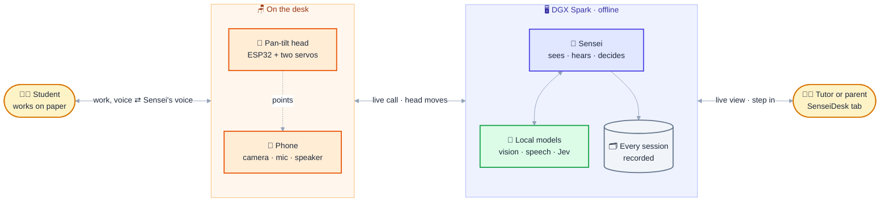
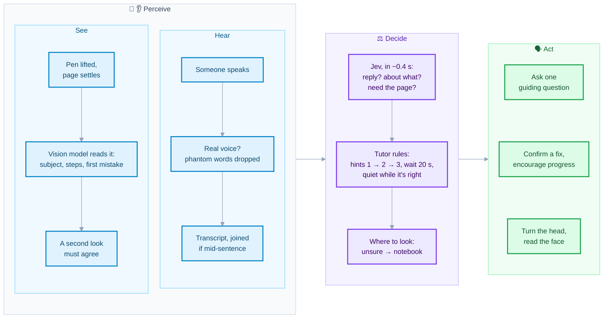
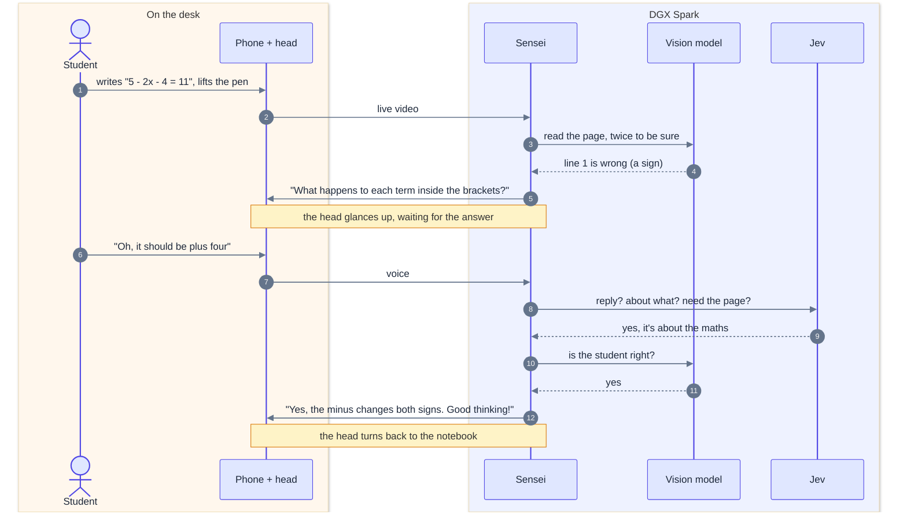

# SenseiAI

**A desk tutor that watches you work on paper, finds the first line that went wrong, and asks
you a question instead of giving you the answer. It runs on one box, with no internet.**

**Sensei** is a multilingual Socratic tutor. **Sensei Desk** is its body: a phone camera on a
pan-tilt head we designed and built, driven by an ESP32, that looks at the student's notebook,
looks up at the student when it matters, listens, and talks. Everything it sees, hears and
decides runs locally on an NVIDIA DGX Spark: the vision model, speech recognition, face
detection, and a local System One decision model. The mission is affordable one-to-one
tutoring for students without access to it, starting with Bangladesh, where "works offline" is
a requirement, not a feature.

> A student writes `5 - (2x - 4) = 11`, then `5 - 2x - 4 = 11`, and lifts the pen.
> A few seconds later Sensei says: *"What happens to each term inside the brackets when you
> subtract them?"* The student says: *"Oh, the minus changes both signs, so it should be plus
> four."* Sensei: *"Yes, the minus sign changes both signs inside the parentheses. Good
> thinking!"* Nothing left the room.

Built for the Antler × Austin Hardtech Hackathon (Deep Tech Week, Sept 2026).

---

## At a glance

| | |
|---|---|
| **Sees** | Reads handwritten or printed work in math, physics and chemistry; finds the **first** wrong line; tells a correct step from a new problem written underneath |
| **Teaches** | Socratic hints that escalate over three levels on the same mistake, with a subject-specific playbook; never gives the answer; stays quiet while the work is right |
| **Hears** | Voice mode with on-box speech recognition; drops the phantom words Whisper invents from silence; waits for a student who pauses mid-sentence |
| **Decides fast** | A local Jev-style System One model (JevK5, ~375 ms) decides whether to reply at all, what the student is talking about, whether the page is needed, and whether they moved to a new problem |
| **Moves** | A pan-tilt head on an ESP32 turns between the notebook and the student, frames the student's face, and reads their expression to set its tone |
| **Runs offline** | Phone to Spark over Wi-Fi, every model on the Spark; from anywhere via Tailscale Funnel and a locked-down TURN relay |
| **Records** | Every session as video, audio and a timed event log of everything Sensei read, heard, decided and said |
| **Lets a human in** | **SenseiDesk**: a tutor or parent watches the live call (video and the student's voice) and every decision from any browser, and can step in: hints, checks, say something, move the head |
| **Tested** | 144 automated tests, including real Whisper on synthesized speech and a simulated ESP32; every model choice made by measuring on our own data |

---

## Architecture

### The big picture

A student works on paper. The phone on the head sees and hears them and speaks for Sensei. The
Spark does all the thinking, and a human tutor or parent can watch and step in from anywhere.

### How Sensei decides

The models perceive and word things; **plain code decides whether to speak**. That's what keeps
Sensei quiet while the work is right, and stops it repeating itself.

### One tutoring moment

### What runs where

| Piece | What it is | Where |
|---|---|---|
| Sensei Cam | React Native (Expo) app on the phone: camera, mic, text-to-speech, the student's buttons | the phone |
| Pan-tilt head | ESP32 firmware driving two servos, over USB serial | the desk |
| Gateway | FastAPI + aiortc: the call, recording, tutor, ears, gaze, head, Jev client, console | Spark `:8787` |
| Vision model | `qwen3-vl-30b-a3b` behind the Spark's model router (vLLM / llama.cpp) | Spark `:8010` |
| Speech | faster-whisper `small.en` + Silero VAD, on the CPU | inside the gateway |
| Faces | YuNet face detector, on the CPU | inside the gateway |
| Jev | JevK5, a local System One decision model | Spark `:8095` |
| TURN relay | coturn, localhost only, short-lived credentials | Spark `:3478` |
| SenseiDesk | The desk tab of the Sensei web app, for a human tutor or parent | any browser |
| Remote access | Tailscale Funnel: `:8443` for the gateway, `:10000` for the relay | public HTTPS |

---

## What it can do

### Eyes: reading the work

- Judges the page only when it matters: after the hand has left the page for about 3 seconds
  and something new has been written. A hand still on the page, or a page upside down, is never
  judged as a mistake; Sensei asks to turn the page instead.
- Finds the **first** wrong line, checking each line against the one above. Writing the problem
  down is never counted as a mistake unless the original is visible and differs.
- Tells a mistake from a **new problem** written under finished work, and follows the student to
  it. Several problems on one page are tracked separately.
- A mistake must be seen on **two looks** before Sensei says anything: one bad read (a shadow,
  half a line) never becomes a hint.
- **What do you see?** describes anything in view, not just homework, and reads out its text.
- Every judged frame is saved (`judged_NNN.jpg`) next to what the model read and said, and how
  long it took.

### Teaching: Socratic, by subject

- **Three hint levels** on the same mistake: point at the line, name the idea as a question, then
  a simpler parallel problem that isolates the same idea. Never the answer or the next line.
  After three hints on one mistake it lets go instead of nagging.
- **Subject playbooks** for math, physics and chemistry, with a fixed list of mistake kinds per
  subject taken from ranked, sourced lists of the most common student mistakes:

  | | Where the mistake usually is | The student's own check |
  |---|---|---|
  | Math | a minus through brackets, (a+b)² = a²+b², the chain rule, one term divided | put the answer back in |
  | Physics | before the algebra: units, components, normal force on a slope, sign convention | units, size and direction |
  | Chemistry | what a formula means: subscripts, limiting reagent, Celsius in gas laws | count atoms and charge |

- The subject comes from the page, or from the student ("help me with my physics homework").
- **Wait time**: after a hint, 20 seconds to find it before being asked again.
- **Feedback on correct work**: a short "that's right so far" after two new correct lines, at
  most every 45 seconds. A fixed mistake is acknowledged; a finished problem is congratulated
  and the student is asked to check it the subject's way.
- Session shape: greeting, one-minute warning, idle check-in after 90 s, pause and resume, and a
  spoken wrap-up with stats (hints, mistakes found and fixed, problems finished).
- **Tap-only mode** (`SENSEI_TAP_ONLY=1`, or `POST /tap_only`): detects silently and speaks only
  when the student taps Hint or Check.

### Ears: listening

- Voice mode: the phone's mic is live only when the student turns it on, and mutes itself while
  Sensei talks, so Sensei never answers its own voice.
- On-box speech recognition (faster-whisper `small.en` on the CPU, about 1 s per answer).
- **Phantom filter**: Whisper invents "Thank you.", "Okay." or "Silence." from breaths and room
  noise. Silero VAD must hear real voice, and Whisper's stock phrases count only when Whisper
  itself is sure someone spoke.
- **Pauses mid-sentence**: "Yeah, this is the..." waits for "...part I want to do" instead of
  being answered in halves.
- "Say that again" is answered from memory, instantly. Questions asked while Sensei is thinking
  are queued, never dropped.

### Fast decisions: Jev

Jev-style System One models answer typed questions with calibrated probabilities instead of
writing text. Sensei makes **one call per event**, all questions at once:

- **The student finished speaking:** should Sensei reply at all, what is it about (the view, the
  subject, Sensei, small talk, an instruction, unclear), does the answer need the camera image,
  has the student moved to another problem and which one, are they answering Sensei.
- **Where to look:** notebook, student or stay, inside guard rails; when unsure, the notebook.

Backends: local **JevK5** (default, offline), SemIf, decider-4b v2.1 and v2, jevk8, or hosted
Jev, switchable at runtime. If Jev is slow or down, Sensei decides as before and stops trying for
30 s. Every decision is logged.

### Body: the pan-tilt head

- ESP32 firmware (`firmware/`) moves each servo one degree at a time for smooth motion, clamps
  every command to hard limits compiled in and soft limits set at runtime, remembers presets and
  where it was left across power cycles, and ships as a prebuilt image flashable with esptool.
- **Gaze**: Sensei glances up while waiting for an answer to its question, when the student sounds
  stuck ("this is hard", "I don't get it"), or when the page has been still for a long time. A
  glance lasts up to 8 s; at most one every 20 s. Voice commands: "look at my notebook", "look
  at me", "look straight".
- **Face framing**: YuNet finds the face, the angle comes from the camera's field of view, and
  the head nudges until the face is framed. If a servo is mounted the other way round, the framer
  notices and flips that axis.
- **Expression**: the framed face goes to the vision model for one word (engaged, confused,
  frustrated, bored, happy, tired, away), which sets Sensei's tone for the next minute.
- A pulled cable never stops the tutor: a failed move leaves the camera where it was, and the
  head is retried every 15 s.

### SenseiDesk: a human in the loop

The **SenseiDesk** tab of the Sensei web app is the controller for a human tutor or a parent. It
connects to the gateway with the access key and shows:

- **the live call**: the phone's camera over WebRTC, relayed by the gateway, with the student's
  voice one click away; it works from anywhere through the same TURN relay as the phone;
- **everything as it happens**: what the student said, what Sensei read on the page (the exact
  frame, with the wrong line highlighted), what it said and why, where the head looked, and
  what it heard but chose not to answer;
- **the session**: time left, subject, problem, hints given, head and voice-mode state;
- **ways to step in**: start a session, Hint, Check, What do you see?, Repeat, Pause, Hush, End,
  type anything for Sensei to say, move the head, and switch auto-look and Jev.

Behind it are two gateway routes: `GET /events` (a server-sent event stream of every session
event and every message to the phone) and `POST /watch` (a receive-only WebRTC call carrying the
phone's live tracks).

### The app, the console and the network

- **Sensei Cam** (React Native / Expo, Android; every library also supports iOS): full-screen,
  icon-based, 5, 10 or 15-minute sessions, Hint, Check, What do you see?, Repeat, Pause, End,
  voice mode, and the session stats at the end. The access key lives in the Android keystore.
- **Operator console** (any browser): live preview, what Sensei last looked at and what it read,
  type anything for the phone to say, drive the tutor and the head, switch Jev and its backend,
  switch the vision model, calibrate head presets.
- **Three ways to connect**: same Wi-Fi (no internet at all), Tailscale on the phone, or from
  anywhere through Tailscale Funnel with our own TURN relay. The relay listens only on localhost,
  takes only short-lived credentials the gateway issues, and relays only to the Spark, so it
  can't be abused as an open relay. With Funnel, every request needs the access key.

---

## Benchmarks and experiments

Every model and threshold in Sensei was chosen by measuring on our own data. Numbers below are
from runs on the Spark unless marked otherwise.

### Vision model: can it find the mistake, and leave correct work alone?

**Earlier benchmark, 14 models via OpenRouter** (8 planted mistakes): the same Qwen3-VL weights
found **8/8 as a thinking model and 2/8 as instruct**; GLM-4.6V found 7/8 and was best at
pointing to the exact line, at ~55 s.

**On the Spark, 25 Sep** (18 sample pages: 6 math, 6 physics, 6 chemistry; 11 with one planted
mistake, 7 correct):

| Model | Flagged a mistake (of 11) | False alarm on correct work (of 7) | Median per page |
|---|---|---|---|
| `qwen3-vl-30b-a3b-gguf` (live today) | 11 | 6 | 3.3 s |
| `gemma-4-26b-a4b-nvidia-nvfp4` | 8 | 1 | 8.6 s |
| `qwen3.8-27b-unsloth-nvfp4` | 11 | **0** | 23 s |

The fast model flags nearly every page, so its perfect catch rate means little; qwen3.8-27b was
the only clean score. Adding the subject playbooks improved the fast model's hints (they now
target the idea: *"You used the full weight as the normal force..."*) but not its false alarms.
The fast model does confirm a correct **spoken** answer in 1-2 s. Why we haven't switched yet,
and the plan for running a fast and an accurate model side by side, are in
[docs/improvements-2026-09-25.md](docs/improvements-2026-09-25.md) §4.

### Ears: phantom speech (replay of every recorded session)

All recorded sessions were replayed through the real `Ears` pipeline: **144 utterances**, each
scored with Whisper's confidence and Silero VAD's speech length.

| | Silero speech | Whisper no_speech_prob |
|---|---|---|
| Phantoms ("Thank you." ×10, "Okay.", "Silence." ×2, "Bye.", empty...) | 0 s, or under ~1 s with a stock phrase | 0.4-0.75 |
| Real speech | 1.2 s or more | mostly under 0.1 |

The filter dropped **35 of 144 clips, all phantoms, and no real speech**. The textbook Whisper
rule (`no_speech_prob > 0.6 and avg_logprob < -1`) would have missed them.

**Speech model**: `small.en` transcribed 6/6 short math answers correctly where `base.en` got 2/6,
at about 1 s each on the CPU.

### Jev: should Sensei reply? (48 real utterances from our sessions)

| Backend | Should reply (of 47) | Unneeded replies | Moved to a new problem (of 44) | Median / p95 |
|---|---|---|---|---|
| **JevK5 (default, local)** | **43** | **3** | 43 | **375 / 474 ms** |
| SemIf (local) | 39 | 8 | 43 | 384 / 484 ms |
| decider-4b v2.1 (local) | 41 | 5 | 44 | 585 / 686 ms |
| decider-4b v2 (local) | 40 | 6 | 44 | 685 / 691 ms |
| Hosted Jev (reference) | 45 | 1 | 43 | 264 / 299 ms |
| The old word list | 32 | | | |

decider-4b leads the public JevBench v1.4.2, but that lead didn't carry over to Sensei's own
decisions. Local backends are deterministic, which makes their failures reproducible. Full
story, including where Jev-style calibration can and can't be trusted:
[docs/jev-report.md](docs/jev-report.md).

### From the demo logs

The first session with the head attached (25 Sep) found three things no unit test had: a failed
head move silently stopped all page reading, Jev's gaze choice pulled the camera to the student's
face every 3 s while they wrote, and Sensei answered "Thank you." that nobody had said. All three
are fixed and covered by tests. Write-up:
[docs/improvements-2026-09-25.md](docs/improvements-2026-09-25.md).

### Scripts

| Script | What it measures |
|---|---|
| `gateway/eval_brain.py` | Vision models on the sample pages: mistakes caught, correct work left alone, latency; `--models a,b,c` races several, `--playbook` adds the subject playbooks |
| `gateway/jev_eval.py` | A Jev backend on the labelled utterances; `--sweep` finds its floors |
| `gateway/jev_compare.py` | Jev backends side by side |
| `gateway/replay_judged.py` | Replays the frames Sensei judged in a real session through the current prompt, to see what it would say now |

---

## Tests

**144 automated tests**, all passing (`cd gateway && pytest`):

| File | Tests | What |
|---|---|---|
| `test_tutor.py` | 75 | Every tutor decision with a scripted brain and a fake clock: when to look, confirming mistakes, hint escalation and letting go, new problems, subjects and playbooks, encouragement, wait time, Jev routing, tap-only mode |
| `test_ears.py` | 23 | Real Whisper on synthesized speech, silence and clicks ignored, loud noise that isn't speech, the phantom rule, pauses mid-sentence |
| `test_head.py` | 14 | The serial protocol and head control against a simulated ESP32 |
| `test_gaze.py` | 12 | Face framing in a simulated room (including a servo mounted backwards), where to look, Jev and its guard rails |
| `test_gateway.py` | 14 | End to end: a real WebRTC call from a fake phone, recording, `/say`, a session with a hint, a spoken question answered, the access key, TURN credentials, swapping the model and Jev at runtime, a SenseiDesk watching the live call |
| `test_plant_contract.py` | 6 | The demo page's contract (projectile, first error on line 1, correct page left alone) through the tutor |

No hardware needed: `fake_phone.py` makes the same WebRTC call as the app (streams a sample page,
can tap Start or speak a WAV), and `fake_head.py` behaves like the ESP32 on a pseudo-terminal.

---

## Datasets

- `datasets/samples/`: math, physics and chemistry problems, each as a printed worksheet, a
  correct handwritten solution and solutions with **exactly one** realistic, documented mistake
  (every line after it consistent with it). Rendered in handwriting fonts with per-character
  jitter and a different hand per student. The mistakes are the most frequent ones reported by
  teachers and education research, with sources. Grade 9-12 sets plus grade 12 and first-year sets
  with figures; multilingual pages (Bengali, Hindi, Spanish).
- `datasets/notesbank/`: 40 real handwritten note pages from the ICDAR 2025 NoTeS-Bank challenge
  (Apache-2.0).

---

## Milestones

1. **Pipes**, done: the phone streams video and voice to the Spark, every session is recorded,
   the Spark makes the phone speak.
2. **Eyes + Brain**, done: timed sessions; Sensei reads the notebook, stays quiet while the work is
   right, asks escalating Socratic questions about the first mistake, and wraps up.
3. **Ears**, done: voice mode, on-box speech recognition, phantom filtering, Jev decisions.
4. **Body**, done: the pan-tilt head, gaze policy, face framing and expression.
5. **Next**: a fast and an accurate vision model side by side, a student model that remembers
   mistakes across sessions, Bangla end to end, letting the student interrupt Sensei, and
   start-on-boot services.

## Repository

| Path | What |
|---|---|
| `app/` | Sensei Cam, the React Native (Expo) Android app ([README](app/README.md)) |
| `gateway/` | The gateway on the Spark: WebRTC, recording, tutor, ears, gaze, head, Jev, console ([README](gateway/README.md)) |
| `firmware/` | ESP32 pan-tilt head firmware, source and prebuilt image ([README](firmware/README.md)) |
| `jev-local/` | Launcher for the local Jev models |
| `datasets/` | Sample solutions and handwritten notes |
| `docs/` | Plans, reports and the demo script |

## Documents

- [docs/tutor-plan.md](docs/tutor-plan.md): the decision layer and the student model, where this is going
- [docs/jev-report.md](docs/jev-report.md): Jev and System One models, measured on our hardware
- [docs/jev-in-sensei.md](docs/jev-in-sensei.md): where fast decisions fit in Sensei
- [docs/improvements-2026-09-25.md](docs/improvements-2026-09-25.md): what the first demo with the head taught us
- [docs/demo-script.md](docs/demo-script.md): the showcase demo, tested problem by problem

## Quick start

1. On the Spark: `cd gateway && uv venv && source .venv/bin/activate && uv pip install -r requirements.txt && uvicorn server:app --host 0.0.0.0 --port 8787`
   (point it at a vision model with `SENSEI_LLM_URL` / `SENSEI_LLM_MODEL` in `sensei.env`; see the
   [gateway README](gateway/README.md) for the head, Jev, and remote access).
2. Build and install the APK on the phone (see [app/README.md](app/README.md)), open it, enter the
   Spark address, and start a session.
3. Open `http://<spark-address>:8787` in a browser to watch, and to see what Sensei sees and decides.
