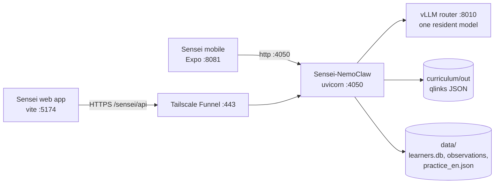

# Sensei + Sensei-NemoClaw — Integration Handoff

Sep 25, 2026 · @Abdullah Khan Zehady (Andy)

Live copy (editable, commentable): https://claude.ai/code/artifact/0b90660e-e406-47b6-af9e-74e71820d8af

## Summary

Sensei is a multilingual Socratic tutor for high-school maths and science, and all of its AI runs on one NVIDIA DGX Spark (GB10). It has two parts:

- **Sensei** ([brishtiteveja/Sensei](https://github.com/brishtiteveja/Sensei)) is what students and teachers use: a React web app (the desktop app), an Expo mobile app, and the curriculum, sample problems and docs.
- **Sensei-NemoClaw** (the Python package is `clawpy`, also called SenseiClaw or DikkhaClaw) is the backend. It is an HTTP service that owns model routing, the teaching prompts, the two-stage handwriting-vision pipeline, the curriculum and question APIs, and the store of student observations.

The web and mobile apps talk only to Sensei-NemoClaw. Sensei-NemoClaw talks only to the local model router on the Spark. Student data (handwriting, mistakes, weak spots) never leaves the box, because students are minors.

The tutor never hands over the answer. A student photographs their handwritten working, a vision model reads it, and a text-only model finds the step where they slipped and asks a guiding question about it.

## Architecture

Every request goes client → Sensei-NemoClaw (:4050) → vLLM router (:8010) → one model resident on the GPU.



| Component | Repo / path | Port | Started by |
| --- | --- | --- | --- |
| Web app (desktop) | `Sensei/web` | 5174 | `run-sensei.sh` (vite) |
| Mobile app | `Sensei/mobile` | 8081 | `run-sensei.sh` (Expo) |
| Backend | `Sensei-NemoClaw` | 4050 | `run-sensei.sh` (uvicorn) |
| Curriculum review dashboard | `curriculum/server.py` | 8090 | `run-sensei.sh` |
| Model router | systemd `vllm-router` | 8010 | systemd |

The main constraint is that the router keeps **exactly one model loaded**. Asking for a different model triggers a cold swap of 1–5 minutes, served on the same HTTP call. The whole box shares one model, `qwen3-vl-30b-a3b-gguf` (vision-capable, needed by the Sensei Desk), so the web app and the desk gateway never evict each other. Don't switch it without checking with the owner.

In production the backend is meant to run inside a NemoClaw / OpenShell sandbox (Landlock + seccomp + an OPA egress proxy). Only `inference.local` is allowed out, and github, pypi, npm and huggingface are blocked. On the Spark today it runs as a plain uvicorn process.

## Sensei (web and mobile apps)

The web app is a React 19 + Vite + Tailwind single-page app served under the subpath `/sensei/`. It supports 8 locales (en, bn, hi, es, zh, id, ms, ha), picked in Settings.

| Screen | Route | What it does |
| --- | --- | --- |
| Dashboard | `/sensei/` | Where the student left off and what to do next |
| Courses | `/courses`, `/courses/:subject/lessons/:lesson` | Physics, Chemistry, Higher Maths, Biology, as units and lessons with a suggested order |
| Learn | `/practice` | Past-exam MCQs one at a time with instant feedback, or "Special examples": curated worked problems solved step by step |
| Notebook | `/notebook` | Photograph handwritten working; the tutor finds the slipped step |
| Ask Sensei | `/tutor` | Streaming Socratic chat |
| Teach | `/teach` | Teacher tools: draft practice questions from rough problems |
| Progress | `/progress` | Mastery per subject and topic |
| Handoff | `/handoff` | Pairs a phone with the desktop through a code |

Configuration:

- `VITE_SENSEI_API_URL`: the backend URL. **Always set it.** Without it, the app falls back to `https://spark-e257.tail803c7f.ts.net:8449`, which only works inside the tailnet.
- The base path `/sensei/` is fixed in `web/vite.config.ts` and must match the reverse-proxy mount.
- Sample problems, slides and the notes bank live in the repo's `samples/`, `slides/` and `notesbank`. `scripts/copy-samples.mjs` copies them into `web/public/`, and it runs only on `npm run build`. **Run it by hand before `npx vite` in dev mode**, or Special examples fails with `Unexpected token '<' ... is not valid JSON`.

The mobile app (`Sensei/mobile`) is an Expo React Native client of the same backend. It uses `EXPO_PUBLIC_SENSEI_API_URL` (tutor) and `EXPO_PUBLIC_API_BASE_URL` (mock tests, credits); on this box both point at :4050. There are no user accounts here, so login does not work.

## Sensei-NemoClaw (backend)

Sensei-NemoClaw is a FastAPI service (`clawpy.server:app`, Python 3.12) and the only thing the apps call. It was forked from ClawPy, a multi-provider coding agent, which is why the package is still named `clawpy`.

Its core loop is `POST /tutor/coach`, which runs in two stages:

1. **Read:** a vision model at temperature 0.2 transcribes the handwritten page (for example "line 2: negative not distributed").
2. **Teach:** a text-only model at temperature 0.6 turns that reading into `{status, hint, question, focus}`. It never sees pixels, so it can be a different model (even a cloud one) via the per-request `reading_model` / `coaching_model` overrides.

Measured on a real handwritten page: 8.3 s with both stages local, 6.4 s with local reading plus Gemini teaching.

| Route | Purpose |
| --- | --- |
| `POST /tutor/coach` | Both stages, the core loop |
| `POST /tutor/see` | Stage 1 only (chat attachments, session replay) |
| `POST /tutor/stream` | Streaming Socratic chat |
| `POST /tutor/hint`, `/tutor/explain`, `/tutor/query` | Single-turn help |
| `GET /tutor/health` | Health check (`/health` returns 404) |
| `POST /grade` | Teacher-side marking against a rubric |
| `GET /curriculum/*` | Subjects, lessons, tracks, exams, regions, plans (`?lang=`) |
| `POST /curriculum/translate` | Curriculum text into the student's language |
| `GET /practice/questions`, `/practice/subjects` | Practice MCQs (`?subject=&lang=&limit=&exclude=`) |
| `/mocktest/*`, `/ai/credits/*` | Mock tests from the question bank; credits are unlimited here |
| `POST /observe`, `/observe/attempt` | Learning-event stream and attempt summaries |
| `GET /handoff/{code}` | Phone-to-desktop pairing relay |
| `GET`/`POST /admin/model`, `/admin/models` | Runtime model switching (POST needs `SENSEI_ADMIN_TOKEN`) |

Full schema: `GET /openapi.json` or `/docs` on the running service.

Where its data lives:

- **Exam question bank:** about 12,500 Bangla past-exam questions linked to concepts, read from `/home/perspectivity-dgx/projects/curriculum/out/qlinks.<subject>.json` (`SENSEI_QLINKS_DIR`). Postgres is not installed, so `practice_store.py` serves these files.
- **English starter set:** `data/practice_en.json`, 20 high-school MCQs (5 each for physics, chemistry, maths, biology), added 25 Sep 2026. `/practice/questions?lang=en` serves these instead of the Bangla bank.
- **Learner state:** `data/learners.db`, `data/observations/`, `data/plans/`.

## Running it and public access

The live stack is public at **https://spark-e257.tail803c7f.ts.net/sensei/** (web app), with the backend at **https://spark-e257.tail803c7f.ts.net/sensei/api** (strip-prefix proxy to :4050). Both are exposed with Tailscale Funnel on port 443, as path routes beside Open WebUI at `/`.

On the Spark, one script brings up everything:

```bash
cd /home/perspectivity-dgx/projects
./run-sensei.sh          # start (idempotent)
./run-sensei.sh status   # what is up
./run-sensei.sh stop     # stop everything except the router
```

Logs go to `/home/perspectivity-dgx/models/logs/` (`dikkhaclaw.log`, `sensei-web.log`, `sensei-expo.log`).

The backend needs these environment variables, all set by the script:

| Variable | Value on the Spark | Why |
| --- | --- | --- |
| `CLAWPY_PROVIDER` | `openai` | Defaults to Gemini; without it every chat turn fails with "Missing or invalid Authorization header" |
| `OPENAI_BASE_URL`, `SENSEI_LOCAL_BASE_URL` | `http://localhost:8010/v1` | The local router |
| `OPENAI_API_KEY`, `SENSEI_LOCAL_API_KEY` | from `models/router-api-key.txt` | Router bearer token |
| `CLAWPY_MODEL`, `SENSEI_TEACHER_MODEL` | `qwen3-vl-30b-a3b-gguf` | The shared pinned model (persisted in `data/model_choice.json`) |
| `SENSEI_ADMIN_TOKEN` | from `models/sensei-admin-token.txt` | Guards `POST /admin/*`, which the Funnel makes public |

To set up the Funnel routes again:

```bash
tailscale funnel --bg --https=443 --set-path=/sensei     http://127.0.0.1:5174/sensei
tailscale funnel --bg --https=443 --set-path=/sensei/api http://127.0.0.1:4050
```

Funnel only allows ports 443, 8443 and 10000. On this box 8443 is the phone call gateway and 10000 is its TURN relay, so Sensei must stay as a path on 443.

## Integration notes for the Sensei desk

To integrate, call Sensei-NemoClaw's HTTP API at `https://spark-e257.tail803c7f.ts.net/sensei/api`; CORS is open (`Access-Control-Allow-Origin: *`). Things that will catch you out:

- **Model swaps are slow.** The first request after another model was loaded can take 2–4 minutes. Use client timeouts of at least 90 s for practice and 600 s for tutoring, and don't switch models per request.
- **Health check path.** Use `GET /tutor/health`, not `/health`.
- **Language.** Pass `lang` (en, bn, hi, es, zh, id, ms, ha) on curriculum and practice calls. Practice in English serves only the 20-question starter set; other non-Bangla languages get the Bangla bank.
- **Reasoning models** return `content: null` with the text in `reasoning`; the backend handles this, but a direct router client must too.
- **Admin routes are public** through the Funnel. `POST /admin/*` needs the admin token; never ship it in a public client build.
- **No auth or accounts** on this deployment; `/auth/*` does not exist.

Open items:

- [ ] The web app runs in Vite dev mode, which is slow over the Funnel. Serve a production build (`npm run build` + a static server) for real users.
- [ ] `run-sensei.sh` points the web app at the tailnet-only `:8449`. Change `VITE_SENSEI_API_URL` to `https://spark-e257.tail803c7f.ts.net/sensei/api` before the next restart, or public users lose chat.
- [ ] The English question set is a 20-question placeholder. Replace it with a real English bank or turn on on-demand translation.
- [ ] Check whether Courses lesson content is in English when English is selected.
- [ ] The 25 Sep changes to Sensei-NemoClaw (`practice_store.py`, `server.py`, `data/practice_en.json`) are not committed yet.

More detail: `others/hackathon/sensei/HANDOFF.md` and `NEMOCLAW.md` in the Sensei repo, and the Sensei-NemoClaw README.
